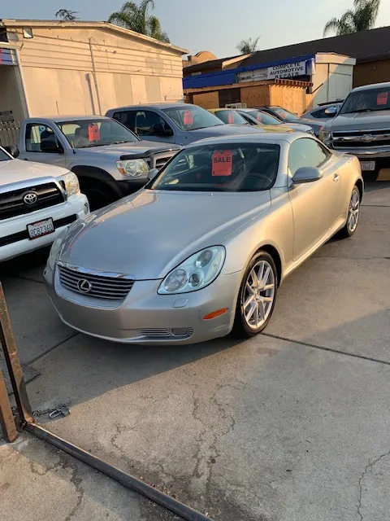
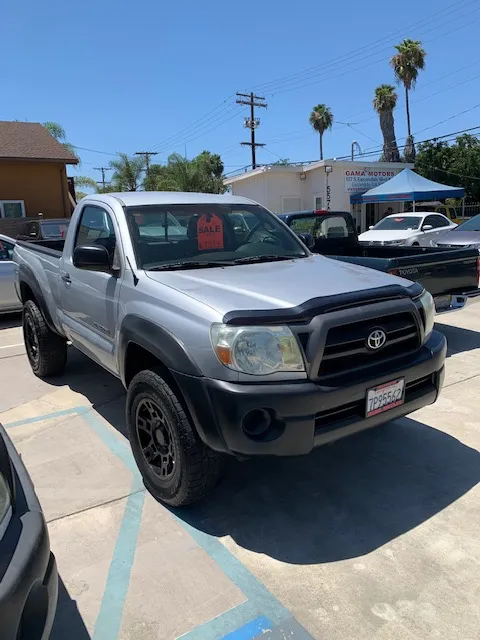
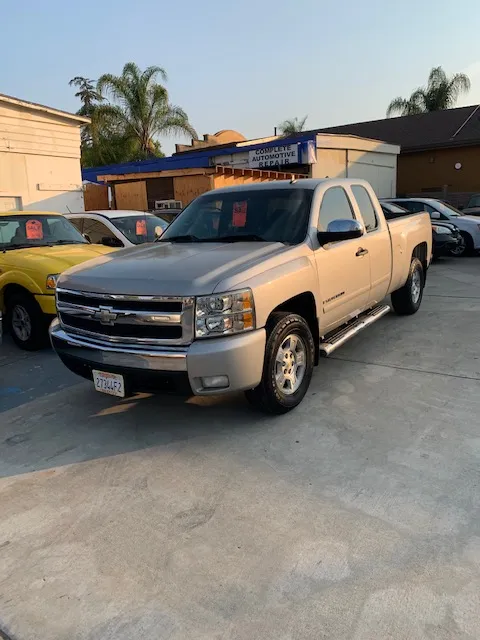

<h2>Gallery</h2>

 

            
            
2002 Lexus SC430
 
            
            
2005 Toyota Tacoma
 

 

            
            
2007 Chevrolet Silverado
 
            
            
2008 Toyota Sienna
 

            
            
2007 Chevrolet Silverado
 
            
            
2008 Toyota Sienna
 

<!-- plans for backend: easy to add new images + links -->

